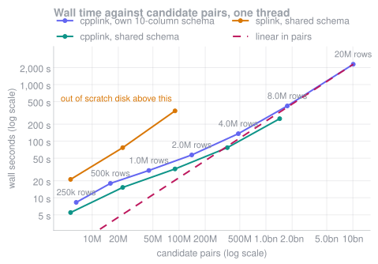
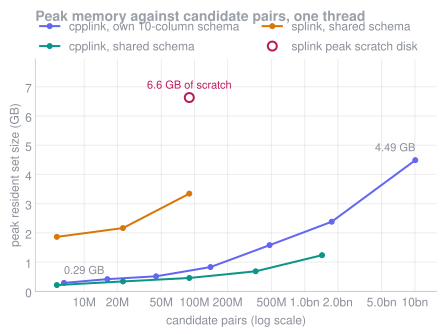

# cpplink

[](LICENSE)
[](https://en.cppreference.com/w/cpp/17)

**cpplink** is a fast, streaming probabilistic record linker in C++. It implements the Fellegi–Sunter model — EM parameter estimation, term-frequency adjustments, and prediction — without ever materializing a table of candidate pairs.

This project is heavily inspired by [splink], and reuses many of the ideas and design choices that make Splink such a useful record linkage tool.
Splink was also an important part of how I learned and explored the record linkage problem while developing cpplink, so this project is in large part a didactic exercise as well as a practical tool. Kudos to the Splink developers for building such a great resource.

The main motivation for cpplink was practical: I wanted to run probabilistic record linkage on datasets that did not fit comfortably in memory on a laptop.
Splink's architecture relies on SQL engines to construct and process intermediate candidate-pair tables, which can become expensive in memory and storage as datasets grow.
Rather than materializing those pairs, cpplink generates candidates as a stream and immediately reduces each pair to its Fellegi–Sunter agreement pattern.

The result is essentially a memory-friendly, C++ implementation of a Splink-style record linkage workflow, without requiring a SQL database or materializing a table of candidate pairs.

## Approach

A pair enters the Fellegi–Sunter likelihood only through its agreement pattern γ, the vector of comparison-level indices. Two pairs with the same γ are indistinguishable to the model, so estimation needs only `count[γ]`, a histogram bounded by the number of *distinct* patterns rather than the number of pairs. On the 20M-record deduplication below:

|  | pair table | pattern histogram |
|---|---:|---:|
| Candidate pairs | 1.01×10¹⁰ | 1.01×10¹⁰ |
| Stored rows | 1.01×10¹⁰ | ~10⁵ |
| Resident memory | 121 GB *(at 12 bytes a pair)* | 4.49 GB *(measured)* |
| Cost of one EM re-fit | re-read everything | < 0.1 s |

Blocking is a lazy iterator rather than a join, candidate pairs are deduplicated across sources by a cheap predicate instead of a global `DISTINCT`, and term-frequency adjustment is made affordable by admissible score bounds that let most patterns skip the TF tables entirely.

Measured against Splink on the same data, the same schema and the same machine, [`bench/scale/`](bench/scale/) runs 4M records over 1.44bn candidate pairs in **89.2 s at 1.16 GB resident with no scratch file**.
At 1M records, where both tools finish, cpplink is **4.4x** faster end to end than Splink's best configuration here and uses 8.9x less memory, for the same quality (F1 0.9974 against 0.9961).
Splink did not finish at 2M on this machine, and what it ran out of was temp space rather than memory.

Blocking is also **automatic**. Rather than hand-written rules, candidates come from the term-frequency tables the model already needs — pairs are generated from agreement on *rare* values, which is exactly the high-evidence event the model scores — supplemented by MinHash LSH and sorted-neighbourhood passes.
Sources that select on a whole record rather than a column (an ANN index, for instance) are used for prediction only, because they break the conditional-independence argument that makes EM's parameter estimates unbiased.

None of those sources is a new idea (see [prior art](#prior-art)) so the useful question is not which to believe in but which earns its candidates, and that is measured rather than argued.
`recall` reports pair completeness, pair quality and the reduction ratio per source and for the plan; [`bench/sweep_blocking.py`](bench/) sweeps each method over its own knob and reports the frontier, because every method can buy recall with candidates and a single operating point per method compares nothing.

## Performance

The following benchmark was run on a MacBook Air (Apple M1, 16 GB RAM).
The design target is **20M records**, and the whole pipeline has been run there: `estimate` → `predict` → `cluster` over 20,000,000 synthetic records and **10,090,976,646 candidate pairs** in **38.1 minutes on a single thread**, at **4.49 GB peak resident memory**, with no scratch file and F1 0.9946 against the planted duplicates.
The two figures below are single-threaded sweeps from 250k to 20M records on one machine, drawn against candidate pairs rather than records because that is the axis on which two blocking plans are comparable: time is linear in pairs, while memory tracks records, since nothing in the pipeline holds a row per pair.
Splink is drawn beside it on a shared schema, the intersection of the levels and blocking rules both tools express identically, which is the only way to give two tools the same model; cpplink is run twice, once on each schema, so that line has a like-for-like partner.





Further information about the benchmark, including precision, recall, and F1 score, can be found in [`bench/scale/`](bench/scale/README.md).

## Usage

cpplink is told what is in the data with a JSON schema, see [examples/sample_schema.json](examples/sample_schema.json):

```json
{
  "unique_id": "id",
  "columns": [
    {"name": "last_name",      "type": "string"},
    {"name": "dob",            "type": "date"},
    {"name": "latitude",       "type": "double"},
    {"name": "address_tokens", "type": "string_list"}
  ]
}
```

`string` columns are interned to dense `uint32` ids, `string_list` columns are stored as CSR with each row sorted, `date` is days since the epoch, and `double` is stored as-is.
Only the first three carry term frequencies: exact agreement between two doubles is not a discrete event worth counting, so a `double` column cannot drive rare-value blocking.

A column can also be derived from another rather than read from the file, which is cheap here because interning makes an exact level on a derived key an integer equality and the transform runs once per distinct value rather than once per row:

```json
{
  "name": "surname_key",
  "derive": {"from": "surname", "transform": "soundex"}
},
{
  "name": "name_key",
  "derive": {"from": "full_name", "transform": ["normalize", "sorted_tokens"]}
}
```

The transforms are `normalize`, `sorted_tokens`, `soundex`, `email_username`, `email_domain`, and the date parts `year`, `month`, `day` and `year_month`; a list applies them in order and is type-checked against the source column when the schema is parsed.
A derived column is interned, counted, blocked on and compared like any other, and because the derivation is a functional dependency the schema has declared, estimation treats it and its source as one piece of evidence rather than two.

Comparisons are declared in the same file. Levels are evaluated top-down and the first hit wins, so their order is the model, put the strongest evidence first.
A comparison can span more than one column: a coordinate pair is one comparison, not two.

```json
{"name": "location", "columns": ["latitude", "longitude"], "levels": [
  {"type": "null"},
  {"type": "geo_within", "threshold": 1},
  {"type": "geo_within", "threshold": 25},
  {"type": "else"}]}
```

Available level types: `null`, `exact`, `levenshtein`, `jaro_winkler`, `date_within`, `numeric_within`, `geo_within`, `list_overlap`, `list_jaccard`, `list_contains`, `contains_levenshtein`, `contains_jaro_winkler`, `list_levenshtein`, `list_jaro_winkler`, `else`.
A configuration that applies a level to a column type it cannot read, omits a trailing `else`, or overflows the 32-bit packed pattern is rejected at parse time, before a file is opened.

A comparison can also name several string columns and let each level say which one it reads, so a field and a key derived from it are ranked inside one comparison rather than counted twice.
This is how splink's email comparison is written here: exact on the address, then exact on the username, then Jaro-Winkler on either.

```json
{"name": "email_username", "derive": {"from": "email", "transform": "email_username"}}
```

```json
{
  "name": "email",
  "columns": ["email", "email_username"],
  "term_frequency": true,
  "levels": [
    {"type": "null"},
    {"type": "exact"},
    {"type": "exact", "column": "email_username"},
    {"type": "jaro_winkler", "threshold": 0.88},
    {"type": "jaro_winkler", "threshold": 0.88, "column": "email_username"},
    {"type": "else"}
  ]
}
```

The username is a declared column rather than something the comparison extracts on the fly, and that is deliberate.
splink's `EmailComparison` runs `regexp_extract` inside the comparison, once per pair, which is fine when everything is per pair anyway; here it would turn an integer equality into a `find('@')`, a substring and a string compare on every candidate.
Declared as a column, the split runs once per distinct address at load, the username is interned and counted like any other column, and that is what gives its exact level a term-frequency adjustment, a closed-form `u`, a signature table for the fuzzy bound, and the option of blocking on it.
The cost is one `uint32` a row plus the username dictionary, and a column that shows in `inspect` and `profile` under the name you gave it.
A level without a `column` reads the first one.
The comparison is null wherever any of its columns is, so an address with nothing before the `@` compares as missing rather than falling through to `else`.
Each exact level gets its own term-frequency adjustment, over the column it read, and the first one's `u` is still closed form: an address is the column whose collision rate sits near `1/N`, where a sampled `u` sees nothing.
What the shape does not get is `--fuzzy-tf`, `--fuzzy-u` and `cpplink levels`, which read a single column, and `simplify` never merges two levels reading different columns.

`list_contains` is the one level whose two columns have different types: a scalar string against a list of aliases, firing when either row's value is an element of the other row's list.
It is how a `first_name` is checked against a `nicknames` column, and it sits in the same comparison as the name's own levels, ordered between them:

```json
{
  "name": "forename",
  "columns": ["first_name", "nicknames"],
  "levels": [
    {"type": "null"},
    {"type": "exact"},
    {"type": "list_contains"},
    {"type": "jaro_winkler", "threshold": 0.9},
    {"type": "else"}
  ]
}
```

`list_levenshtein` and `list_jaro_winkler` are the pairwise levels: they read one list column and fire on the *closest* pair of elements over the cross product of the two rows' lists, so two sets of email addresses that share nothing but differ by a typo still agree.
The set-valued levels above them read the intersection, which is the special case where the closest pair is a shared element, so they belong higher in the same comparison:

```json
{
  "name": "emails",
  "columns": ["emails"],
  "levels": [
    {"type": "null"},
    {"type": "list_overlap", "threshold": 1},
    {"type": "list_levenshtein", "threshold": 1},
    {"type": "list_jaro_winkler", "threshold": 0.9},
    {"type": "else"}
  ]
}
```

The cost is the cross product: |a| x |b| metric evaluations where a scalar fuzzy level runs one.
A shared element settles the level with a linear merge before that walk starts, and the per-value signature bounds reject an element pair for two popcounts, but a column holding long lists is still the one place a fuzzy level can become expensive.

`contains_levenshtein` and `contains_jaro_winkler` are the fuzzy half of that bridge, over the same two columns and in the same two directions: they fire when either row's value is within the threshold of an *element* of the other row's list, so an alias list holding `bill` reaches a row named `bil`.
They cost |a| + |b| metric evaluations rather than the pairwise levels' |a| x |b|, because only one side of each comparison is a list.
Rank them below `list_contains`, which implies them and is stronger evidence: being 0.91 similar to an alias is not being one, and on a fixture where two rows carry `will` for unrelated reasons the fuzzy level agrees where membership refuses.

Blocking sources are declared in the same file and unioned in order.
Every source here selects on a single column, which is what makes it usable for estimating `m`:

```json
"blocking": [
  {"type": "exact_value", "column": "email"},
  {"type": "rare_value", "column": "last_name", "max_frequency": 100},
  {"type": "minhash", "column": "last_name", "bands": 10, "rows_per_band": 4},
  {"type": "sorted_neighbourhood", "column": "last_name", "window": 20}
]
```

```sh
# Report cardinality, null rates and the memory each structure costs
cpplink inspect --schema examples/sample_schema.json data.parquet

# Ledger what the columns can be worth, what a matching pair will score, and
# which pairs of columns are the same evidence twice; no model, no blocking
# plan, no known pairs
cpplink profile --schema examples/sample_schema.json data.parquet

# Check the schema's fuzzy thresholds against the column they run on, from the
# exact u curve of the dictionary self-join and an m curve from anchor pairs
cpplink levels --schema examples/sample_schema.json --out proposed.json data.parquet

# Show which level each comparison assigns to one pair, and the packed pattern
cpplink explain --schema examples/sample_schema.json --pair r17,r19 data.parquet

# Price every blocking source exactly, without enumerating a single pair
cpplink explain-blocking --schema examples/sample_schema.json data.parquet

# Measure what fraction of known duplicate pairs blocking actually reaches
cpplink recall --schema examples/sample_schema.json --truth truth.csv data.parquet

# Learn m, u and lambda and write the model
cpplink estimate --schema examples/sample_schema.json --out model.json data.parquet

# Merge adjacent levels a run of this size cannot tell apart, which narrows the
# packed pattern; --min-gap decides on how much a level is worth rather than on
# whether the difference is significant, which on a large file it always is
cpplink simplify --schema examples/sample_schema.json --model model.json \
                 --min-gap 1.0 --out simpler.json data.parquet

# Score every candidate pair and write the predictions above a threshold. --out
# names a directory to get one shard per thread, or a .csv/.parquet file to get
# one file: threads still write a shard each and the run merges them at the end.
# -v prints the plan first (every source priced, the threshold, where the output
# goes) and a progress line while the pairs are walked, on stderr
cpplink predict --schema examples/sample_schema.json --model model.json \
                --out predictions.parquet --threshold 20 -v data.parquet

# Re-score a spilled run under a new model, without comparing anything again
cpplink predict --schema examples/sample_schema.json --model model.json \
                --out predictions/ --spill spill/ --threshold 20 data.parquet
cpplink rescore --schema examples/sample_schema.json --model tuned.json \
                --spill spill/ --out predictions2/ --threshold 20 data.parquet

# Join those predictions into duplicate clusters, and score the result against
# known pairs; --predictions takes the merged file or the shard directory
cpplink cluster --schema examples/sample_schema.json --predictions predictions.parquet \
                --out clusters.csv --truth truth.csv data.parquet

# Combine the shards of an existing run into one file something else can open
cpplink merge-predictions --schema examples/sample_schema.json --shards predictions/ \
                          --out predictions.parquet data.parquet

# Write a sample file with realistic cardinalities and planted duplicates
cpplink gen-sample --out sample.parquet --rows 18000000 --truth sample.truth.csv
```

`gen-sample` exists because the memory claims above are only worth making if they are measured.
It plants corrupted copies of earlier rows and records them, so the file also serves as the ground truth `recall` and `cluster --truth` score against.

## Planned features

- Parquet input with a JSON schema, including list-valued columns *(done)*
- Configurable comparisons and ordered comparison levels *(done)*
- Fellegi–Sunter model over the resulting agreement patterns *(done)*
- EM estimation of `m` and `λ`; exact closed-form `u` for exact-match levels *(done)*
- Term-frequency adjustments, with admissible bounds for pruning *(done)*
- Per-value character signatures bounding the string metrics, and Myers' bit-vector
  edit distance *(done)*
- Automatic blocking: exact-value and rare-value inverted indexes, MinHash LSH and sorted
  neighbourhood, with exact candidate-count reporting and recall measurement *(done)*
- ~~Optional ANN blocking for prediction~~ — **retired by measurement, not built.** `recall
  --why` shows no missed pair that fails to agree, exactly or fuzzily, on a column already in the schema, so an ANN index would have nothing to find; the remaining misses are columns that are simply not blocked on
- Multicore, shared-memory parallelism *(estimation and scoring done)*
- Connected-component clustering of the predictions *(done)*
- Spill of (a, b, γ) and re-scoring under a new model without a second comparison pass *(done)*
- Deduplication and record linkage across datasets through the same interfaces *(done)*
- A pair-global score ceiling that refuses a candidate before any string metric runs *(done)*
- Blocking recall estimated with no ground truth at all *(done)*
- Term-frequency adjustment and exact `u` for the fuzzy levels, from neighbourhood mass *(done)*
- Pre-model data profiling: what each column can be worth, what a matching pair will score,
  and which columns are the same evidence twice *(done)*
- Fuzzy thresholds placed from the data rather than by hand *(done)*
- Columns derived from other columns at load, once per distinct value *(done)*
- Merging the comparison levels a run cannot tell apart *(done)*
- Two-way corrections for the columns that are not conditionally independent *(done)*
- Validation at the 20M-record target *(done; see [Scaling](#scaling) and [`bench/scale/`](bench/scale/))*
- The same validation on real data rather than generated data, and a splink comparison above 1M records *(not yet run)*

## Getting Started

### Prerequisites

- CMake 3.15 or higher
- A C++17 compatible compiler
- GoogleTest (for the test suite)

The dependencies are declared in [environment.yml](environment.yml):

```sh
conda env create -f environment.yml
conda activate cpplink
```

### Building

```sh
cmake -S . -B build
cmake --build build
```

### Testing

```sh
cmake -S . -B build -DBUILD_TESTING=on -DCMAKE_PREFIX_PATH=$CONDA_PREFIX
cmake --build build
ctest --test-dir build
```

## Prior art

The blocking methods here are drawn from the record linkage and entity resolution literature rather than invented for this tool, and it is worth being explicit about which is which.

| Source | Prior art |
|---|---|
| sorted neighbourhood | Hernández & Stolfo 1995 |
| rare-value inverted index | IDF-weighted canopies (McCallum, Nigam & Ungar 2000); rare-token ordering in prefix-filtering similarity joins (Bayardo, Ma & Srikant 2007; Xiao et al. 2008) |
| MinHash LSH | Broder 1997; Indyk & Motwani 1998; benchmarked for record linkage by Steorts, Ventura, Sadinle & Fienberg 2014 |
| ANN over embeddings | DeepER (2018), AutoBlock (2020), DeepBlocker (2021), Sparkly (2023) |
| automatic blocking as such | Michelson & Knoblock 2006; Bilenko, Kamath & Mooney 2006; Kejriwal & Miranker 2013; the `dedupe` library; token blocking and meta-blocking (Papadakis et al.) |

Christen's 2012 survey of indexing techniques covers most of these and is the reference for the pair-completeness, pair-quality and reduction-ratio metrics `recall` reports.

What this project claims is narrower, and none of it is a blocking method:

1. **The EM-safety criterion** — a pair source may feed estimation only if its selection
   event factors as a condition on an excludable column subset. A whole-record source biases *every* `m_c` with no column left to repair it, so estimation and prediction run over different unions of sources.
2. **Admissible per-pattern term-frequency brackets** that let most patterns be emitted or dropped without touching the TF tables, emitting exactly the predictions a full scoring pass would.
3. **Exact closed-form candidate pricing** from the term-frequency tables, which prices 8.25 billion pairs without enumerating one.
4. **The streaming implementation.** γ's sufficiency is Fellegi & Sunter 1969; that a full Fellegi–Sunter pipeline with TF adjustment fits in memory at 20M records, because nothing in it holds a row per pair, is an engineering result rather than a statistical one.

## Documentation

The full documentation — the model and the EM algorithm, the blocking sources, and a page per command explaining its goal and how to read its output — is built with
[MkDocs](https://www.mkdocs.org/) from [docs/](docs/):

```sh
conda activate cpplink
mkdocs serve     # live preview on http://127.0.0.1:8000
mkdocs build     # render to site/
```

## Code Style

This project follows the [Google C++ Style Guide](https://google.github.io/styleguide/cppguide.html) with minor customizations (4-space indent, 90-column limit).

Tools used:

- clang-format for formatting: `cmake --build build --target format`
- cpplint for static analysis: `cpplint --recursive src tests`

## License

This project is licensed under the MIT License. See [LICENSE](LICENSE) for details.


[splink]: https://moj-analytical-services.github.io/splink/